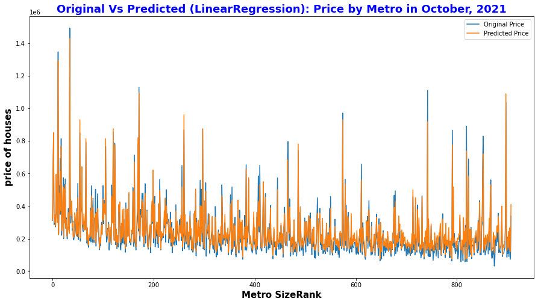
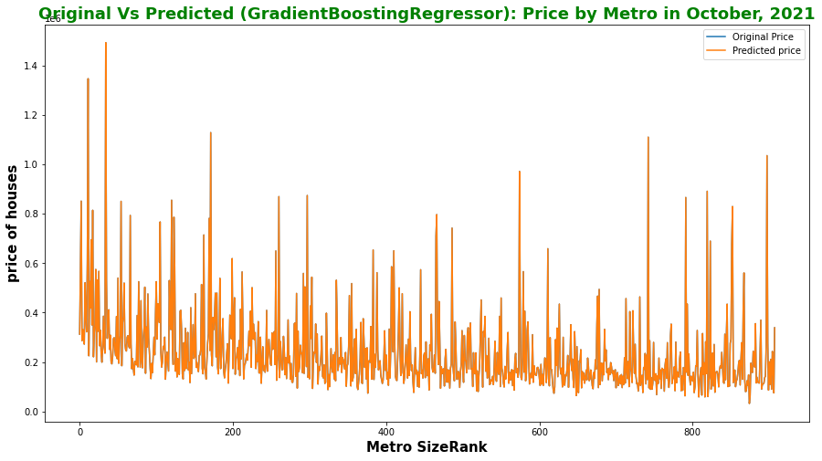

# House-Price-Prediction
**Author**: Rumana Sultana, Mahsa Rahamian

House Price prediction using Data Mining

**Database to use:** -Zillow Home Value Index (ZHVI) & (ZHVF)   
&emsp;  &emsp;  &emsp;&emsp;  &emsp;  &emsp;&emsp; **Description:** Zillow Home Value Index dataset that is a smoothed, seasonally adjusted measure of the typical home value and market changes across a given region and housing type. 
&emsp;  &emsp; &emsp;  &emsp; &emsp;&emsp;  &emsp; 

**Technology to use:**  Linear Regression Model,  
                        &emsp; &emsp; &emsp; &emsp; &emsp; &emsp;&emsp;&emsp;Gradient Boosting Regression 

**Platforms:** Jupyter notebook, Python3, Matplotlib, NumPy, SciPy, sklearn, etc. 

**Description of Project:**  The goal of the project to define a Data Mining Solution to be able to predict with some accuracy (currently 45% for linear model) the future home prices for potential investors. 
  **Some Results from project implementation: **
   &emsp;  &emsp;  &emsp;&emsp; &emsp;  &emsp;  &emsp;&emsp;   
   &emsp;  &emsp;  &emsp;&emsp; &emsp;  &emsp;  &emsp;&emsp;   

